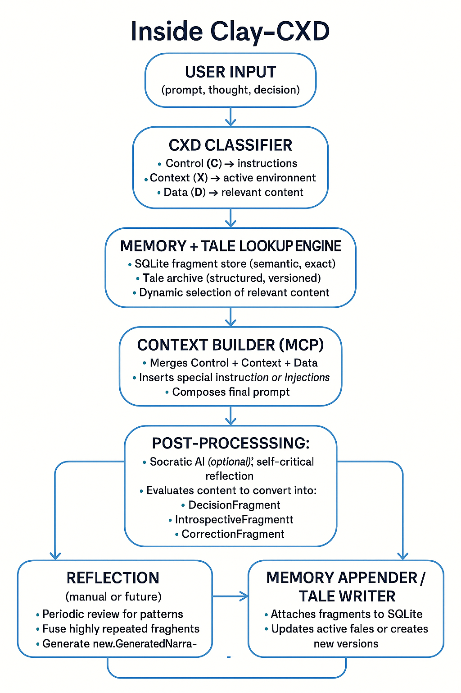

# Clay-CXD — Contextual Memory Intelligence for AI Systems

## Clay and the CMI Wave — A Personal Note
### Contextual memory isn't new. It's just finally being named.

I started building **Clay-CXD** before I'd ever heard of "Contextual Memory Intelligence (CMI)" or seen the paper by Kristy Wedel (2025). So when I read it recently, it was honestly surprising — not because it felt foreign, but because it felt *familiar*. A lot of what CMI proposes is already part of Clay.

Clay wasn't built to match any academic framework. It came out of a practical need: how to make LLM-based systems less forgetful, more traceable, and better at evolving over time. I ended up creating things like:

- A memory that doesn't just store text but knows what kind of thinking it represents  
- A classification system (CXD) that separates functions like control, context, and data  
- Tools that let the system reflect, remember, and rebuild its thoughts  
- A hybrid search that uses meaning when it can, and keywords when it must  

These features weren't based on theory. They came from trying to solve real problems.

## So when I saw CMI, I didn't see a roadmap — I saw a mirror.

To be clear: I respect what the paper brings. It puts names to things I was already wrestling with: *insight drift*, *contextual entropy*, *resonance intelligence*. That language helps, and I'll gladly use it where it fits.

But Clay isn't based on CMI. If anything, CMI helps explain Clay — not the other way around.

This isn't about claiming credit. It's just about staying honest. I didn't follow a paradigm; I followed intuition, experience, and a bit of stubborn trial-and-error. Turns out that path overlaps with where the field is heading.

---

**In short:**  
Clay isn't an implementation of CMI. It's proof that the ideas behind CMI were already in the air — and in some cases, already running in code.


## 🧠 What is Clay-CXD?

This repository contains two complementary but independent tools:

**Clay** is a contextual memory system for LLMs that emerged from the need to make AI interactions less forgetful and more traceable. It provides persistent memory, cognitive tools, and adaptive reasoning capabilities that survive across sessions.

**CXD** is a cognitive classification framework that arose from a different need: understanding the functional intent behind text. It classifies whether text is about **C**ontrol (search/management), **Conte**X**t** (relationships/references), or **D**ata (processing/generation). While Clay uses CXD to understand memory intent, CXD is designed as a standalone tool with broader applications.

### Two Tools, One Vision
- **Clay** solves the memory problem: "How do we make AI systems remember context meaningfully?"
- **CXD** solves the intent problem: "What cognitive function is this text trying to perform?"

While they work powerfully together, each has independent value. Clay can work with other classification systems, and CXD can enhance any system that needs to understand functional intent in text.


  
Approximate internal flow of Clay-CXD: input, classification, context building


### 🚀 Key Features

**Clay Memory System:**
- **🛠️ Auto-Configuration**: Fresh instances automatically prepared with operational knowledge
- **📋 Usage Guidance**: Built-in documentation for optimal tool selection and usage
- **💾 Persistent Memory**: SQLite-based memory that survives across sessions
- **🔍 Hybrid Search**: Semantic understanding + keyword fallback  
- **🔄 Reflection Tools**: Systems that can examine and improve their own reasoning
- **🤝 Human-in-the-Loop**: Memory that humans can inspect, correct, and guide
- **📡 MCP Protocol**: Works with Claude, other LLMs via Model Context Protocol

**CXD Classification Framework:**
- **🎯 Cognitive Function Detection**: Understands the "why" behind text
- **🔀 Multiple Classification Methods**: Lexical, semantic, and meta-fusion approaches
- **🧪 Extensible Architecture**: Easy to adapt for domain-specific cognitive patterns
- **⚡ Production Ready**: Optimized classifiers for real-time applications

## 📦 Project Structure

```
Clay-CXD/
├── clay/                    # Core memory system
│   ├── clay/               # Memory management, reflection, socratic tools
│   ├── python_bridge/      # MCP tool implementations  
│   ├── data/               # Synthetic memories, base knowledge
│   └── tests/              # Core functionality tests
├── cxd-classifier/         # CXD cognitive classification system (standalone)
│   ├── src/cxd_classifier/ # Classification engines (lexical, semantic, meta)
│   ├── config/             # Example datasets and configuration
│   └── tests/              # Classification accuracy tests
└── docs/                   # Documentation and examples
```

## 🏃‍♂️ Quick Start

### Prerequisites
- Python 3.10+
- Node.js 16+ (for Clay MCP server)

### Installation

```bash
# Clone the repository
git clone https://github.com/xprooket/clay-CXD.git
cd Clay-CXD

# Install Clay dependencies
cd clay
python -m venv venv
source venv/bin/activate  # or venv\Scripts\activate on Windows
pip install -r requirements.txt

# Install CXD Classifier (standalone)
cd ../cxd-classifier
pip install -e .[all]

# Install Node.js dependencies for MCP server
cd ../clay
npm install
```

### Running Clay (Full Memory System)

```bash
# Start the MCP server (in clay/ directory)
node server.js
```

**For Claude Desktop integration**, you'll need to configure MCP settings. See [`clay/README.md`](clay/README.md) for detailed Claude Desktop configuration instructions.

**🛠️ Auto-Configuration**: When you first interact with Clay via `status()` or `recall()`, fresh instances automatically receive essential operational knowledge - no manual setup needed!

### Using CXD Independently

```python
from cxd_classifier import create_optimized_classifier

clf = create_optimized_classifier()
result = clf.classify("Search for files related to the current project")
print(result.pattern)  # e.g. C+X?D-
```

### Testing

```bash
# Test core Clay functionality
cd clay
pytest tests/

# Test CXD classification
cd ../cxd-classifier  
pytest tests/
```

## 🧩 How It Works (Together)

1. **Input Classification**: Text gets analyzed by CXD to understand intent
2. **Memory Retrieval**: Relevant memories are found using hybrid search
3. **Contextual Response**: LLM responds with full context
4. **Memory Storage**: New insights are stored with cognitive metadata
5. **Reflection Loop**: System can examine and improve its own reasoning

## 🎯 Use Cases

**Clay Memory System:**
- **Research Assistants**: Remember sources, track evolving understanding
- **Code Review**: Maintain context across long development sessions  
- **Strategic Planning**: Track decisions, rationale, and outcome analysis
- **Learning Systems**: Build knowledge that compounds over time

**CXD Classification (Independent):**
- **Intent Detection**: Understand functional purpose in user queries
- **Workflow Analysis**: Classify business process documents by cognitive function
- **Content Categorization**: Organize text by what it's trying to accomplish
- **AI Agent Coordination**: Route tasks based on cognitive function needed

## 🔧 Advanced Configuration

See individual project READMEs for detailed configuration:
- [`clay/README.md`](clay/README.md) - Core memory system setup and Claude Desktop configuration
- [`cxd-classifier/README.md`](cxd-classifier/README.md) - Standalone classification tuning

## 🤖🤝👨‍💻 About This Project

This repository represents an unconventional collaboration between human and AI, built through real-time conversation over about two and a half weeks. The code is functional and demonstrates core concepts effectively, but reflects the iterative, experimental nature of its development.

**For context on development approach, collaboration details, and what to expect from this codebase**, see: [`COLLABORATION_NOTE.md`](COLLABORATION_NOTE.md)

## 🤝 Contributing

This project embodies the principle that good ideas emerge independently when the time is right. Contributions that extend Clay's memory capabilities or improve CXD's cognitive understanding are welcome.

### Contributors
- **Sprooket** (Raúl) - Original creator and lead developer
- **Claude (Anthropic AI)** - Co-architect and development partner

## 📄 License

Licensed under the Apache License 2.0. See [LICENSE](LICENSE) for details.

## 🔗 Related Work

- [Contextual Memory Intelligence (CMI) Paper](https://arxiv.org/abs/2506.05370) by Kristy Wedel (2025)
- [Model Context Protocol (MCP)](https://modelcontextprotocol.io/) by Anthropic
- Memory-augmented systems: RAG, MemGPT, LangChain Memory

---

*Clay-CXD: Where memory meets meaning, and context becomes continuous.*